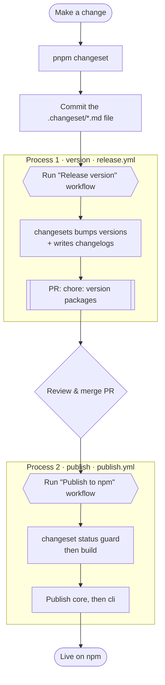

# Releasing webmark

Releasing is split into two independent steps, each its own manual GitHub Actions workflow: **versioning** bumps version numbers and writes changelogs; **publishing** builds and pushes to npm. They never run as one — you version, review, then publish.



## Step by step

### 1. Describe the change

Run `pnpm changeset` at the repo root, select the affected packages, pick a bump level (patch / minor / major), and write a short summary. Commit the generated `.changeset/*.md` file.

```bash
pnpm changeset
git add .changeset
git commit -m "chore: add changeset for <description>"
```

### 2. Version — open the bump PR

Go to **Actions → Release (version)** and click **Run workflow**. The workflow:

- Consumes all pending `.changeset/*.md` files
- Bumps the `version` field in each affected `package.json`
- Regenerates `CHANGELOG.md` for each package
- Opens a `chore: version packages` pull request

It does **not** publish anything.

### 3. Review and merge

Review the PR. The diff should show only version bumps and changelog entries. Merging lands the new versions on `main`.

### 4. Publish — push to npm

Go to **Actions → Publish to npm** and click **Run workflow**. You can choose to publish only `core`, only `cli`, or both.

The workflow:

1. Guards against unpublished changesets (`changeset status`) — if any `.changeset/*.md` files are still pending, it stops. Run the version step first.
2. Builds all packages.
3. Publishes `@webmarkjs/core` first.
4. Publishes `@webmarkjs/cli` second (`cli` depends on `core` via `workspace:*`, which pnpm rewrites to the real version on pack).

## Notes

- **Internal dependency sync.** When `core` bumps, `cli` automatically gets a `patch` bump pointing at the new `core` version (`updateInternalDependencies: "patch"` in `.changeset/config.json`).
- **NPM_TOKEN.** Publishing requires an `NPM_TOKEN` secret in the repository settings with publish access for the `@webmarkjs` scope.
- **No force-push to npm.** If you need to republish an already-published version, bump the version first.
