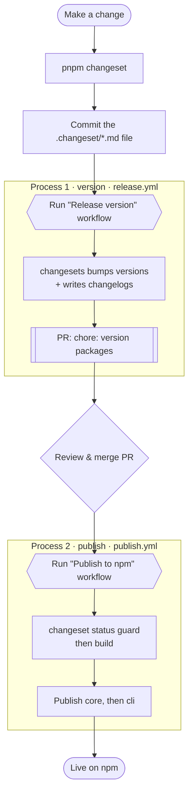

# webmark

Synthetic web performance measurement focused on user-centric metrics.

A single run is a single data point — it can be skewed by a CPU spike, a network hiccup, or GC. webmark runs multiple times and computes **avg, min, max, p75, p99, σ, and histogram** over the results, giving you a distribution instead of a guess.

```
metric    avg      sd     (min … max)      p75      p99
LCP       1.8s    0.2s   (1.5s…2.3s)      1.9s     2.3s
FCP       1.1s    0.1s   (0.9s…1.3s)      1.2s     1.3s
CLS       0.02    0.01   (0.00…0.04)      0.03     0.04
TTI       2.1s    0.3s   (1.7s…2.8s)      2.3s     2.8s
```

## Packages

| Package | Description |
|---------|-------------|
| [`@webmarkjs/core`](./packages/core) | Core measurement primitives |
| [`@webmarkjs/cli`](./packages/cli) | Terminal interface |
| `@webmarkjs/ci` *(soon)* | GitHub Actions — comment results on PRs |

## Releasing

Releasing is split into two independent steps, each its own manual workflow: **versioning** decides the new version numbers, **publishing** pushes them to npm. They never run as one — you version, review, then publish.



### Step by step

1. **Describe the change.** Run `pnpm changeset`, pick the affected packages and a bump level (patch / minor / major), and write a short summary. Commit the generated `.changeset/*.md`.
2. **Version** — run the **Release (version)** workflow (`workflow_dispatch`). It consumes the pending changesets, bumps every affected `package.json`, regenerates `CHANGELOG.md`, and opens a `chore: version packages` PR. It does **not** publish.
3. **Review & merge** that PR. Merging lands the new versions on `main`.
4. **Publish** — run the **Publish to npm** workflow (`workflow_dispatch`). It refuses to run while changesets are still pending (`changeset status` guard), builds, then publishes `@webmarkjs/core` first and `@webmarkjs/cli` second (cli depends on core via `workspace:*`).

> Internal dependencies are kept in sync automatically: when `core` bumps, `cli` gets a `patch` bump pointing at the new `core` (`updateInternalDependencies: "patch"`).
